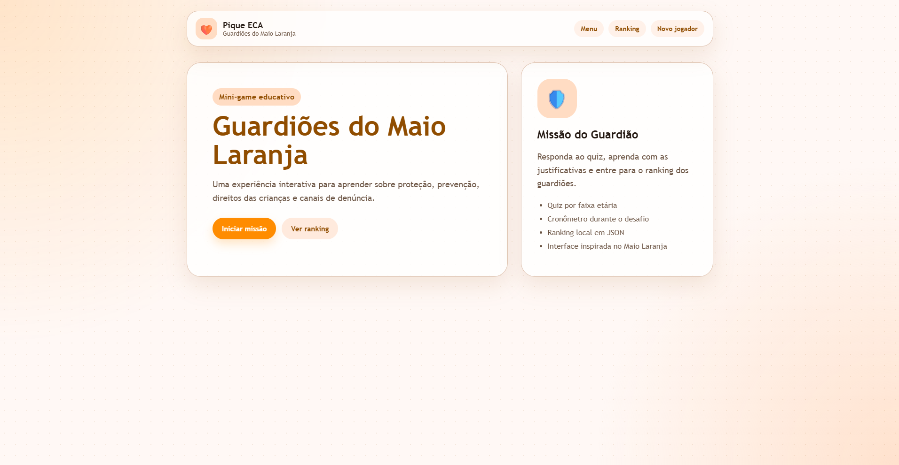
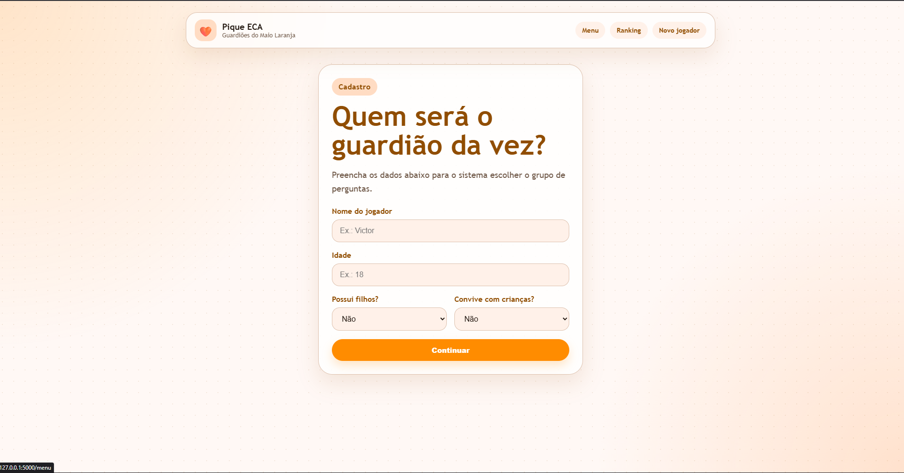
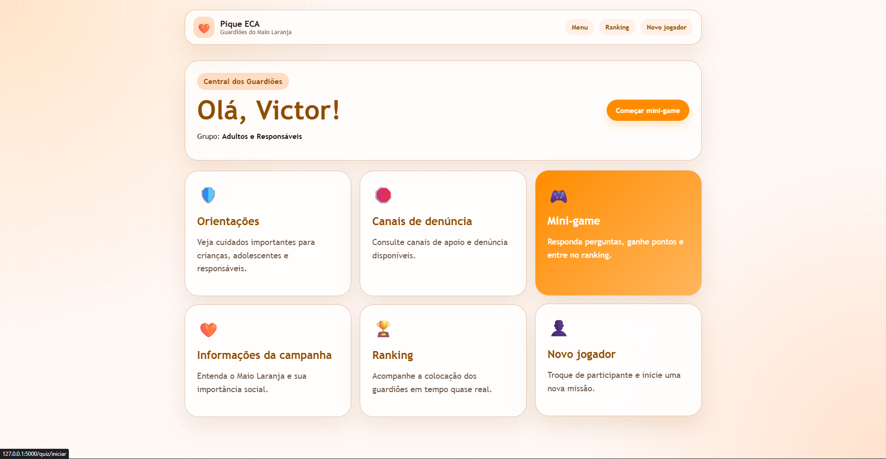
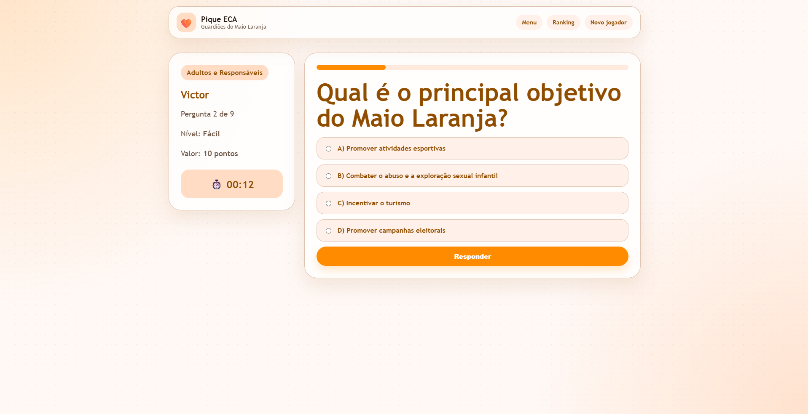
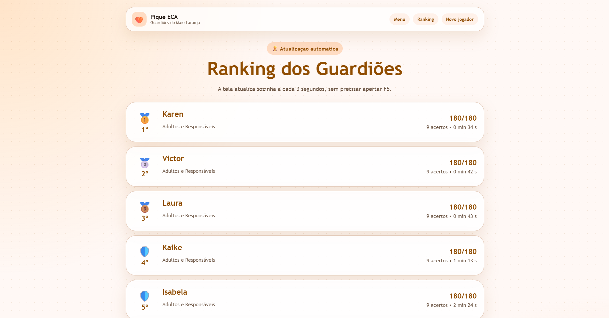
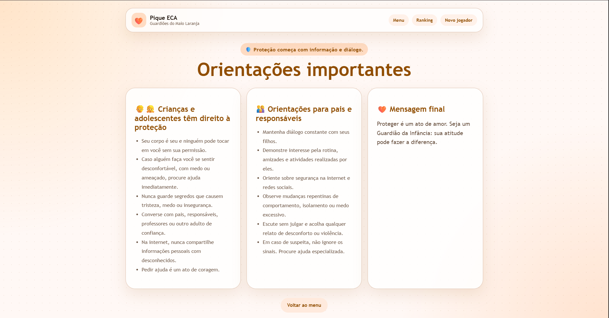
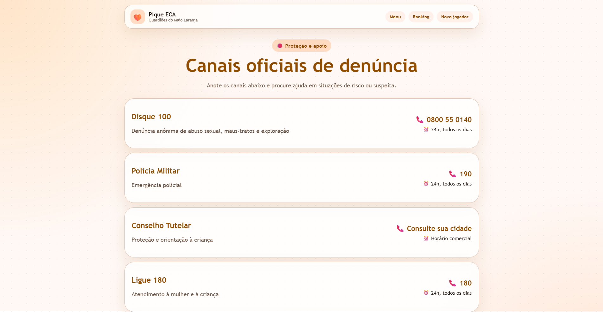

<div align="center">

# Guardiões do Maio Laranja

### Pique ECA

Mini-game educativo desenvolvido em Python para conscientização sobre o Maio Laranja, prevenção ao abuso e à exploração sexual infantil, direitos de crianças e adolescentes e canais oficiais de denúncia.

</div>

<p align="center">
  
</p>

---

## Sobre o projeto

O **Guardiões do Maio Laranja** é um projeto acadêmico que utiliza um quiz interativo como ferramenta de conscientização e aprendizagem.

A aplicação apresenta conteúdos sobre proteção de crianças e adolescentes, orientações de prevenção, informações sobre a campanha Maio Laranja e canais oficiais de denúncia. Durante o mini-game, o jogador responde perguntas adequadas ao seu perfil, acumula pontos e pode acompanhar sua colocação em um ranking local.

O projeto possui duas formas de execução:

* **Versão terminal:** executada por `main.py`, preservando a proposta original desenvolvida pelo grupo.
* **Versão web:** executada por `app.py`, utilizando Flask para integrar a lógica em Python com uma interface em HTML e CSS.

---

## Funcionalidades

* Cadastro de jogadores.
* Separação de perguntas por faixa etária e perfil.
* Menu principal de navegação.
* Conteúdo informativo sobre a campanha Maio Laranja.
* Orientações de prevenção para crianças, adolescentes e responsáveis.
* Consulta a canais oficiais de denúncia.
* Mini-game com perguntas de diferentes níveis de dificuldade.
* Pontuação de acordo com a dificuldade das perguntas.
* Cronômetro durante o quiz.
* Ranking local armazenado em JSON.
* Ranking na versão web com atualização automática.

---

## Interface

### Cadastro e menu principal

<p align="center">
  
  
</p>

### Quiz e ranking

<p align="center">
  
  
</p>

### Conteúdo educativo

<p align="center">
  
  
</p>

---

## Tecnologias e conceitos utilizados

**Tecnologias**

* Python
* Flask
* HTML
* CSS
* JSON

**Conceitos trabalhados**

* Variáveis e tipos de dados.
* Estruturas condicionais.
* Laços de repetição.
* Listas e dicionários.
* Funções.
* Manipulação de arquivos JSON.
* Organização modular do projeto.
* Rotas web com Flask.
* Integração entre backend e interface web.

---

## Estrutura do projeto

```text
Pique_eca_interface_integrada/
|
|-- app.py                         # Aplicação web com Flask
|-- main.py                        # Entrada da versão terminal
|-- menu.py                        # Abertura e menu do terminal
|-- cadastro_usuario.py           # Cadastro de jogadores no terminal
|-- orientacoes_e_campanha.py     # Conteúdos de campanha e orientações
|-- canais_denuncias.py           # Canais de denúncia
|-- perguntas.py                  # Banco de perguntas do quiz
|-- quiz.py                       # Lógica do quiz no terminal
|-- ranking.py                    # Ranking local em JSON
|-- utilitarios.py                # Funções auxiliares
|-- requirements.txt              # Dependências da versão web
|
|-- data/
|   `-- ranking.json              # Dados do ranking local
|
|-- templates/                    # Templates HTML da versão web
|-- static/
|   `-- style.css                 # Estilos da interface
|
`-- docs/
    |-- images/                   # Capturas de tela usadas neste README
    `-- interface_referencia/     # Referências visuais da interface
```

---

## Como executar

### 1. Clone o repositório

```bash
git clone URL_DO_REPOSITORIO
cd Pique_eca_interface_integrada
```

### 2. Crie e ative um ambiente virtual

No Windows PowerShell:

```powershell
python -m venv venv
.\venv\Scripts\Activate.ps1
```

No Linux ou macOS:

```bash
python3 -m venv venv
source venv/bin/activate
```

### 3. Instale as dependências

```bash
pip install -r requirements.txt
```

---

## Versão web

Inicie o servidor Flask:

```bash
python app.py
```

Depois acesse no navegador:

```text
http://127.0.0.1:5000
```

Para acessar a aplicação por outro dispositivo conectado à mesma rede, utilize o endereço IP do computador que está executando o Flask, por exemplo:

```text
http://192.168.0.10:5000
```

---

## Versão terminal

Com o ambiente virtual ativo, execute:

```bash
python main.py
```

---

## Objetivo acadêmico

O projeto foi desenvolvido com a proposta de aplicar fundamentos de programação em uma solução de caráter educativo e social. Além da construção do mini-game, o trabalho permitiu praticar organização de código, persistência de dados em JSON e integração de uma aplicação Python com uma interface web.

---

## Aviso

Este projeto possui finalidade educacional e de conscientização. Em situações reais de risco, suspeita ou violência contra crianças e adolescentes, procure os canais oficiais e os órgãos competentes da sua região.
